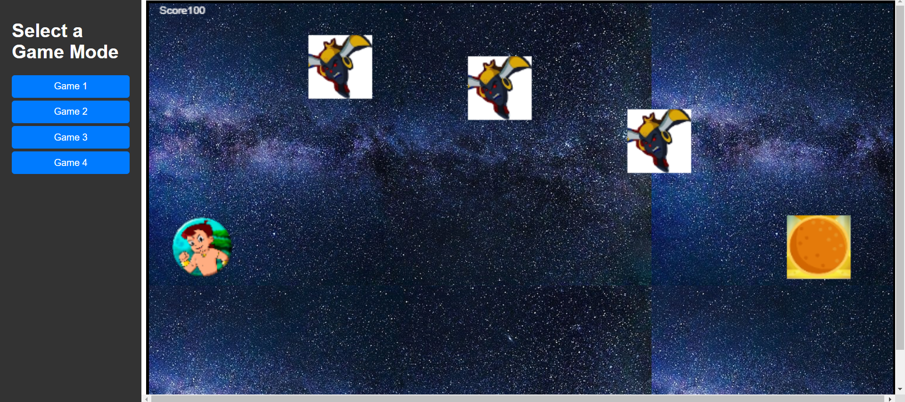
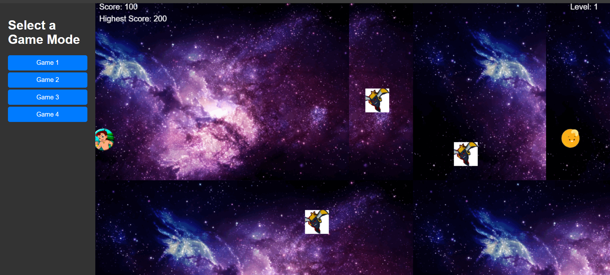
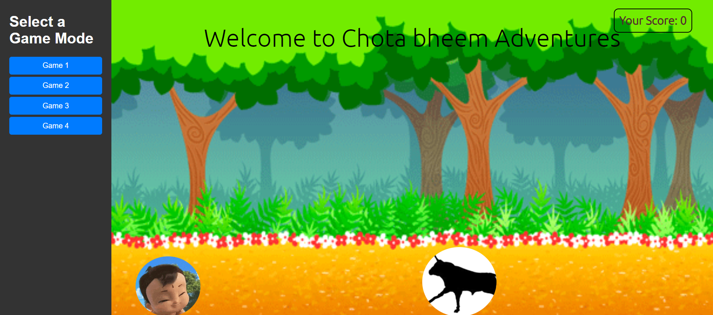
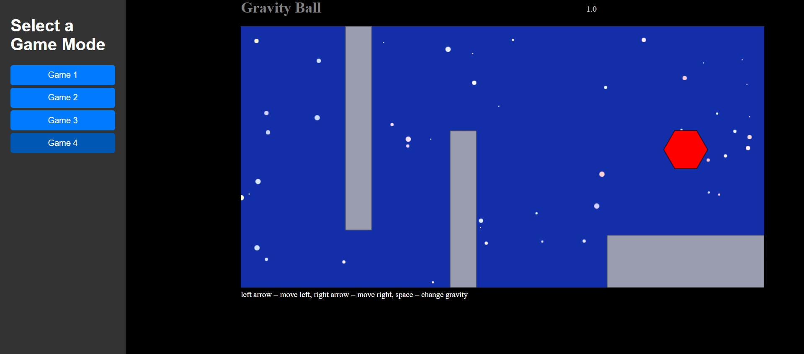

# Adventure Games

Adventure Games is a web application that allows users to play various games. It provides a selection of games, each accessible through a button on the sidebar. When a user selects a game, the corresponding iframe is loaded to allow gameplay.

## Features

- Selection of multiple game modes.
- Dynamic loading of game content using iframes.
- Responsive layout with a left sidebar for game selection.
- Default image displayed when no game is selected.

## Technologies Used

- HTML
- CSS (with Flexbox layout)
- JavaScript

## Usage

1. Clone the repository to your local machine:

```
git clone https://github.com/AkshayTripathi0331/adventure-games.git
```

2. Navigate to the project directory:

```
cd adventure-games
```

3. Open `index.html` in your web browser.

4. Select a game mode from the sidebar buttons to start playing.

## Screenshots






## License

This project is licensed under the MIT License - see the [LICENSE](LICENSE) file for details.
```
